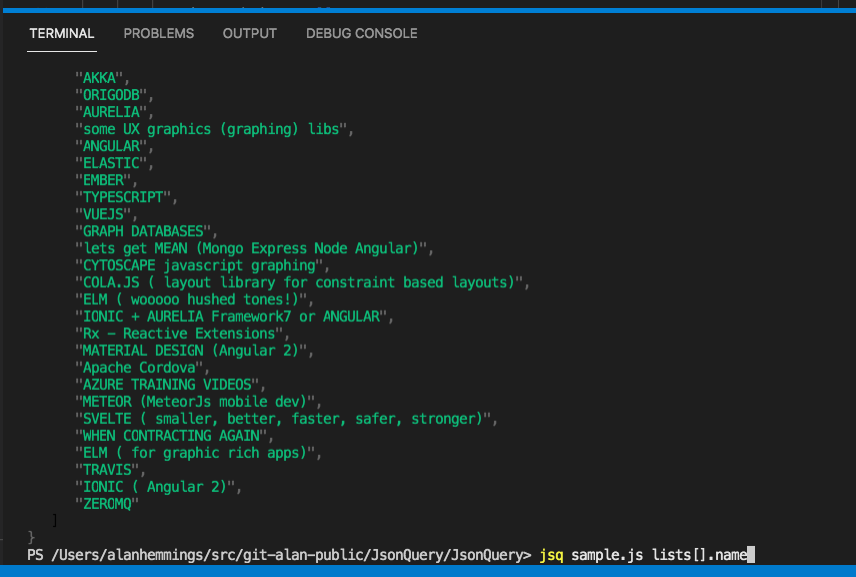

# Goblinfactory.JsonQuery

Cross platform dotnet tool for querying json files and first super hacky support for js files with embedded json. First language supported in JmesPath.

## install

```shell
dotnet tool install --global --add-source ./nupkg goblinfactory.jsonquery
```

## usage

```shell
jsq {filename} {jmespath query expression} [outputfile]
```

example

```shell
jsq sample.js "lists[].name"
```


